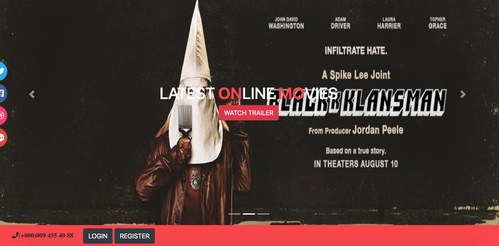
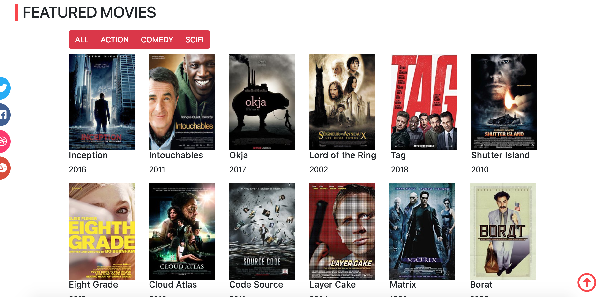
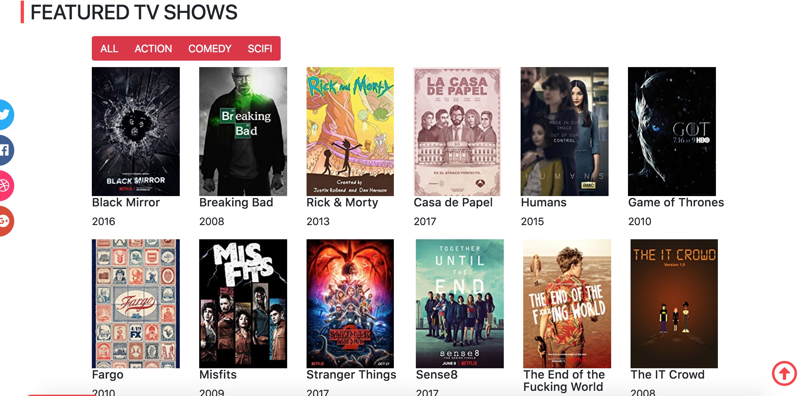
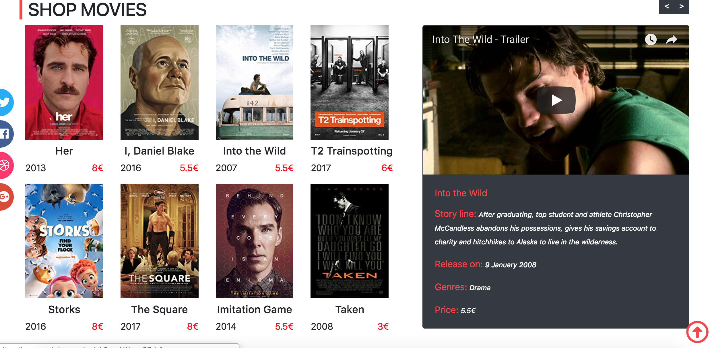

#Allezciné Project

## Front-end project

2 weeks to realise this project (from *18 June 2018*) during BeCode Bootcamp (Team Johnson II).  

Team of 2: Charlotte Tusset & Marie Louise Ogdoc. 

[Repo git with instructions](https://github.com/becodeorg/Johnson2/tree/master/projets/AllezCine). 

--- 

### Objectives

To reaslie a onepage website based on a [layout](https://github.com/becodeorg/Johnson2/blob/master/projets/AllezCine/layout-one-v2.jpg).  

Technologies:
* HTML
* CSS
* JavaScript
* jQuery
* Responsive design
* Bootstrap
* Font Awesome Icons 

---

### Screenshots 

  
  
     
  